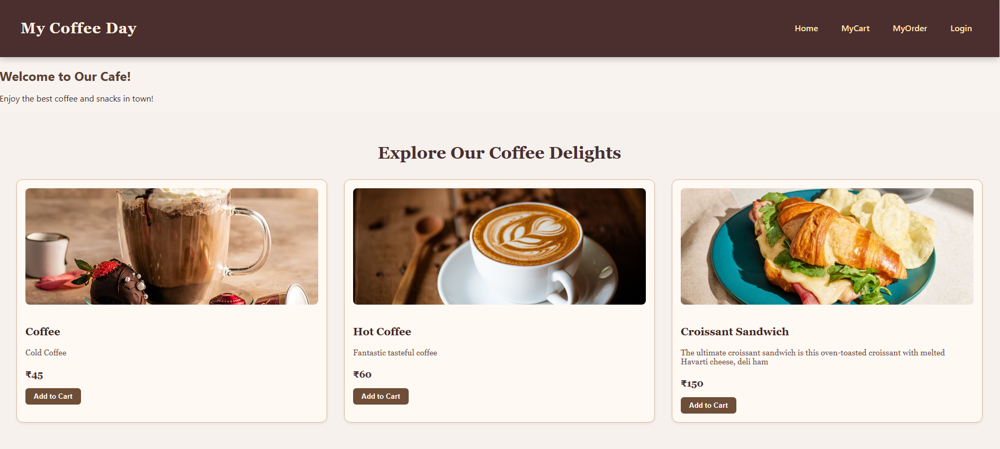

☕ MERN Café Store
A full-stack café e-commerce platform built using the MERN stack (MongoDB, Express.js, React.js, Node.js).
The platform supports user authentication, product browsing, cart management, and order processing, with a dedicated admin panel for managing users, products, and orders.

📌 Features
👤 User Features
Create Account / Login

View Products

Add Products to Cart

Place Orders (login required)

View Order History

🛠 Admin Features
Login as Admin (separate navigation section appears)

Manage Users – Add, Delete

Manage Products – Add, Delete

Manage Orders – Mark as Completed or Rejected

🏗| Category        | Technology                                   |
|-----------------|------------------------------------------------|
| Frontend        | React.js, React Router, Redux / Context API, CSS / Tailwind |
| Backend         | Node.js, Express.js                            |
| Database        | MongoDB (Mongoose)                             |
| Authentication  | JWT (JSON Web Token), bcrypt.js                |

API Testing	Postman
Deployment	Vercel / Render / Heroku (Frontend), MongoDB Atlas (Database)

📂 Folder Structure
csharp
Copy
Edit
MERN-Cafe-Store/
│
├── backend/
│   ├── config/        # DB connection, JWT config
│   ├── controllers/   # API logic (users, products, orders)
│   ├── models/        # Mongoose schemas
│   ├── routes/        # API routes
│   ├── middleware/    # Auth middleware
│   └── server.js      # Entry point
│
├── frontend/
│   ├── public/        # Static files
│   ├── src/
│   │   ├── components/ # Reusable UI components
│   │   ├── pages/      # Screens (Home, Cart, Admin, etc.)
│   │   ├── redux/      # State management
│   │   ├── App.js
│   │   └── index.js
│
├── README.md
└── package.json

⚙️ Installation & Setup
1️⃣ Clone the repository
bash
Copy
Edit
git clone https://github.com/your-username/MERN-Cafe-Store.git
cd MERN-Cafe-Store

2️⃣ Install dependencies
bash
Copy
Edit
# Install backend dependencies
cd backend
npm install

# Install frontend dependencies
cd ../frontend
npm install
3️⃣ Environment Variables
Create a .env file in backend/ with:

ini
Copy
Edit
PORT=5000
MONGO_URI=your_mongodb_connection_string
JWT_SECRET=your_secret_key
4️⃣ Run the project
bash
Copy
Edit
# Run backend
cd backend
npm start

# Run frontend
cd ../frontend
npm start
🔗 API Endpoints Overview
User
Method	Endpoint	Description
POST	/api/users/register	Register new user
POST	/api/users/login	Login user
GET	/api/users/profile	Get user profile

Products
Method	Endpoint	Description
GET	/api/products	Get all products
POST	/api/products	Add product (Admin)
DELETE	/api/products/:id	Delete product (Admin)

Orders
Method	Endpoint	Description
POST	/api/orders	Create new order
GET	/api/orders	Get all orders (Admin)
PUT	/api/orders/:id	Update status (Admin)

🖼 System Architecture
mermaid
Copy
Edit
flowchart LR

    A[User Browser] -->|HTTP Requests| B[React Frontend]
    B -->|API Calls| C[Express.js Backend]
    C -->|Queries| D[MongoDB Database]
    C -->|Auth| E[JWT Authentication]
    F[Admin Panel] -->|Manage Data| C
    
📸 Screenshots

🚀 Deployment
Frontend: https://cafe-frontend-sooty.vercel.app/

Database: MongoDB Atlas

